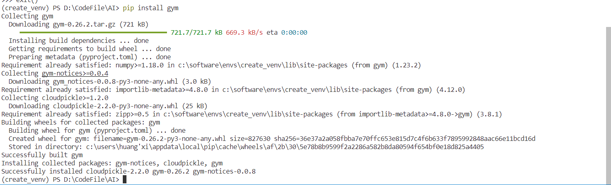
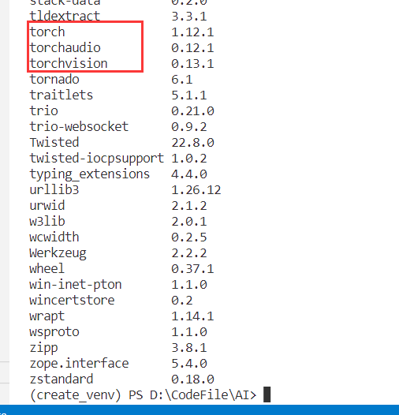

# MVVM学习

## 定义

MVVM是Model-View-ViewModel的简写，它本质上就是MVC 的改进版。MVVM 就是将其中的View 的状态和行为抽象化，让我们将视图 UI 和业务逻辑分开，这就是ViewModel，它取出 Model 的数据同时帮忙处理 View 中由于需要展示内容而涉及的业务逻辑。MVVM（Model-View-ViewModel）框架的由来便是MVP（Model-View-Presenter）[模式](https://baike.baidu.com/item/模式/700029?fromModule=lemma_inlink)与WPF结合的应用方式时发展演变过来的一种新型架构[框架](https://baike.baidu.com/item/框架/1212667?fromModule=lemma_inlink)。它立足于原有MVP框架并且把WPF的新特性糅合进去，以应对客户日益复杂的需求变化。

## 内容

**Model 层**: 对应数据层的域模型，它主要做域模型的同步。通过 Ajax/fetch 等 API 完成客户端和服务端业务 Model 的同 步。在层间关系⾥，它主要⽤于抽象出 ViewModel 中视图的 Model 。

**View层**： 作为视图模板存在，在 MVVM ⾥，整个 View 是⼀个动态模板。除了定义结构、布局外，它展示的是 ViewModel 层的数据和状态。 View 层不负责处理状态， View 层做的是 数据绑定的声明、 指令的声明、 事件绑定的声明。

**ViewModel层**：把 View 需要的层数据暴露，并对 View 层的 数据绑定声明、 指令声明、 事件绑定声明 负责，也就是处 理 View 层的具体业务逻辑。 ViewModel 底层会做好绑定属性的监听。当 ViewModel 中数据变化， View 层会得到更 新；⽽当 View 中声明了数据的双向绑定（通常是表单元素），框架也会监听 View 层（表单）值的变化。⼀旦值变 化，View 层绑定的 ViewModel 中的数据也会得到⾃动更新。

## **MVVM** **的优缺点** **?**

### 优点

1. 分离视图（View）和模型（ Model ） , 降低代码耦合，提高视图或者逻辑的重用性 : 比如视图（View）可以独立于 Model变化和修改，一个 ViewModel 可以绑定不同的 "View" 上，当 View 变化的时候 Model 不可以不变，当 Model 变化的时候View 也可以不变。你可以把一些视图逻辑放在一个 ViewModel ⾥⾯，让很多 view 重用这段视图逻辑。

2. 提高可测试性 : ViewModel 的存在可以帮助开发者更好地编写测试代码。

3. 自动更新 dom: 利用双向绑定 , 数据更新后视图自动更新 , 让开发者从繁琐的手动 dom 中解放。

### 缺点

1. Bug 很难被调试 : 因为使用双向绑定的模式，当你看到界面异常了，有可能是你 View 的代码有 Bug ，也可能是 Model 的代码有问题。数据绑定使得一个位置的Bug 被快速传递到别的位置，要定位原始出问题的地方就变得不那么容易 了。另外，数据绑定的声明是指令式地写在View 的模版当中的，这些内容是没办法去打断点 debug 。

2. 一个大的模块中 model 也会很大，虽然使用方便了也很容易保证了数据的一致性，当时长期持有，不释放内存就造成了花费更多的内存。

3. 对于大型的图形应用程序，视图状态较多， ViewModel 的构建和维护的成本都会比较高。

# WPF学习

## 使用流程

创建WPF项目

在xaml设计界面上使用拖拽的方式或者在代码中新建控件

在对应的cs文件中编写逻辑

## 基础知识

项目的生成的文件结构。如下图:
Properties:资源
引用:引用其他类库
App.xmal:程序主体(一个GUI进程需要有一个窗体，App.xmal文件的作用声明了程序的进程，同时指定程序的主窗体)，点开app.xaml.cs，它是app.xaml的后台代码。
MainWindow1.xmal分支：默认程序的主窗体。

在App.xaml中的“StartupUri”属性可以指定项目运行时的启动窗体。下图中“StartupUri="MainWindow.xaml"”,还可以定义我们需要的系统资源以及引入程序集等。如下图:
xmlns用于在Xaml中声明名称空间的Attribute；冒号的映射名是可选的；引号的字符串确定了哪个类库以及类库哪个名称空间。

MainWindow.xaml的设计窗体中我们可以修改Title。还可以设置MainWindow的属性和添加事件。完成了这些设置以后，我们就可以对窗体添加内容了，如下图:
x:Class是当XAML解析器将包含它的标签的解析成C#类的类名。是来自xmlns:x的命名空间。第一行xmlns是默认命名空间。<Window>和<Grid>都来自默认空间。Title是窗体标题，Height是窗体高度，Width是窗体宽度。可以引用CLS的命名空间。

## 控件的熟悉使用

一般控件放在Grid中

界面元素可以直接拖拽摆放

逻辑编写

实现数据绑定：将listBox的值绑定到label上

DataGrid的绑定数据

代码初始化

comboBox的使用

WPF的学习主要以下几个部分需要重点掌握：

首先是对于xaml的编写 如何有效的进行布局 如何自适应的大小都是我们需要考虑的地方

其次是对逻辑的编写 数据绑定是十分重要的

对WPF控件的练习代码见[WPFlearning](https://github.com/XIUANGH/WpfLearning)　or [Gitee](https://gitee.com/XIUANGH/wpf-learning)

# 选做部分 配置深度学习所需环境

## 配置anaconda

下载安装anaconda

检查安装状态

## 安装驱动

检查驱动版本

可以看到最高可以支持cuda 11.7

下载cuda的驱动

Installed:
     - Nsight for Visual Studio 2022
     - Nsight Monitor
Not Installed:
     - Nsight for Visual Studio 2019
       Reason: VS2019 was not found
     - Nsight for Visual Studio 2017
       Reason: VS2017 was not found
     - Integrated Graphics Frame Debugger and Profiler
       Reason: see https://developer.nvidia.com/nsight-vstools
     - Integrated CUDA Profilers
       Reason: see https://developer.nvidia.com/nsight-vstools

https://developer.nvidia.com/install-nsight-visual-studio-edition

下载cudnn的安装包 将内容复制到cuda文件夹下

复制到

添加到环境变量中

检查是否安装好

## conda创建虚拟环境

已经下载安装了anaconda  首先将anaconda下载源添加

这里直接使用vscode插件创建环境

## 安装pytorch

检查pytorch是否安装好

## 安装gym

## 检查是否安好

